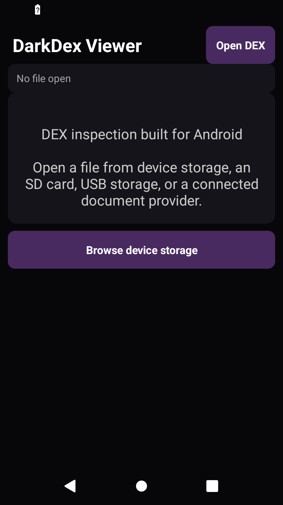
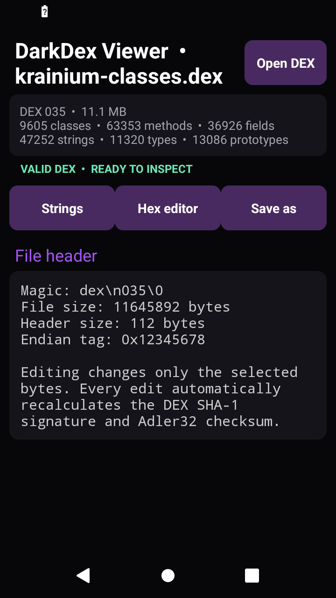
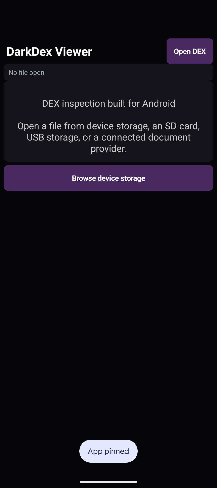
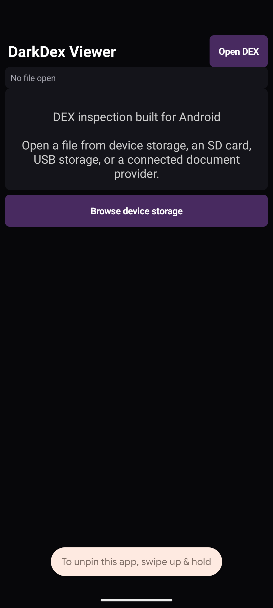
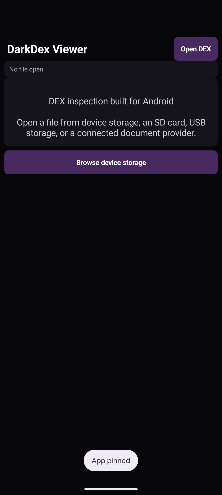

<div align="center">


# DarkDex Viewer

**A focused DEX inspection and editing utility for Android**


Created by **Krainium**

</div>

## 📱 Preview

<table>
<tr>
<td align="center"><strong>Home</strong></td>
<td align="center"><strong>DEX overview</strong></td>
</tr>
<tr>
<td></td>
<td></td>
</tr>
</table>

## ✨ Features

| Icon | Capability | Description |
|:---:|---|---|
| 📂 | Document access | Opens DEX files through the Android document picker |
| 🔎 | String search | Searches and browses the complete DEX string table |
| ✏️ | String editing | Safely replaces strings with matching UTF 8 byte lengths |
| 🧩 | Hex editing | Applies precise byte patches at hexadecimal offsets |
| 🧬 | DEX inspection | Displays version, classes, methods, fields, strings, types, and prototypes |
| ✅ | Integrity repair | Recalculates the SHA 1 signature and Adler32 checksum after every edit |
| 💾 | Safe export | Saves edited data as a separate DEX document |
| 🌙 | Dark interface | Provides a focused dark theme designed for long analysis sessions |

## 📋 Compatibility

| Requirement | Value |
|---|---|
| Minimum Android version | Android 5.0, API 21 |
| Target Android version | Android 14, API 34 |
| Future Android versions | Supported through standard Android APIs with no maximum SDK restriction |
| DEX format | Standard DEX versions 035 through 041 |
| Build runtime | OpenJDK 25 |
| Application bytecode | Java 17 compatible Android bytecode |

## 🛠️ Build

The project uses Gradle 9.1 with OpenJDK 25.

```bash
cd /root/xl/Darkdex_viewer
export JAVA_HOME=/usr/lib/jvm/java-25-openjdk-amd64
/opt/gradle-9.1.0/bin/gradle :app:assembleDebug
```

The generated APK is available in the [Releases](https://github.com/Krainium/DarkDex-Viewer/releases) section.

## 🧪 Validation

Testing uses the following DEX samples:

| File | Classes | Methods | Strings | Result |
|---|---:|---:|---:|:---:|
| classes.dex | 9,605 | 63,353 | 47,252 | ✅ Passed |
| classes2.dex | 5,734 | 36,306 | 24,018 | ✅ Passed |

Each sample passed parsing, editing, payload restoration, SHA 1 verification, Adler32 verification, installation, and application loading tests.


## ☁️ AWS Device Farm verification

The production APK passed AWS Device Farm testing on four real Google Pixel phones running Android 17.

| Device | Android version | Result |
|---|---:|:---:|
| Google Pixel 10 | 17 | ✅ Passed |
| Google Pixel 9 Pro XL | 17 | ✅ Passed |
| Google Pixel 8a | 17 | ✅ Passed |
| Google Pixel 6 Pro Unlocked | 17 | ✅ Passed |

The Device Farm run completed all four jobs successfully with 600 automated interaction events per device. AWS captured 18 screenshots during installation, launch, navigation, and fuzz interaction.

<table>
<tr>
<td></td>
<td></td>
<td></td>
</tr>
</table>

## 🔐 Editing safety

String replacements require an identical UTF 8 byte length. This preserves DEX table offsets and avoids structural corruption. Raw hexadecimal editing is available for advanced changes. DarkDex Viewer repairs the DEX signature and checksum automatically after each edit.

## 🔗 Related

This is the on-device companion to [DarkDex](https://github.com/Krainium/DarkDex), the host-side DEX recovery toolkit for unpacking hardened Android applications.

## ⚖️ Responsible use

DarkDex Viewer is intended for software development, interoperability, education, and authorized security research.